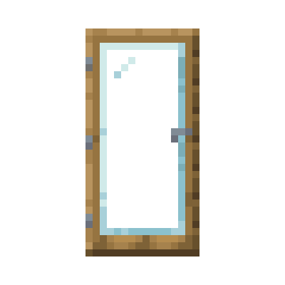

# Modern Glass Doors

Tired of normal boring doors without glass in them? Well look no further, glass doors aims to spice up your world with more modern looking doors.

Simply combine a normal door with a glass pane in a crafting table, or right click an existing door holding a pane to create a glass variant.

